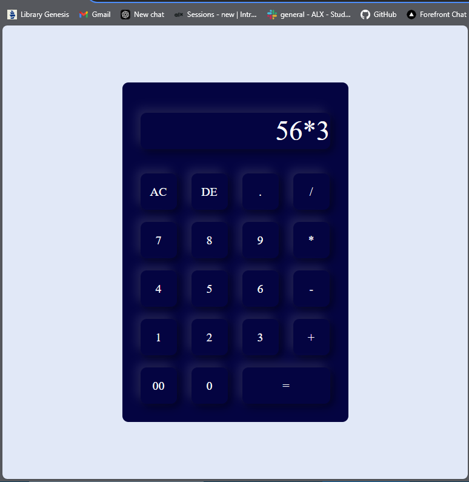

# Simple Calculator

Overview
The Simple Calculator is a web-based application designed for basic arithmetic operations such as addition, subtraction, multiplication, division, and more. It features a user-friendly interface and supports real-time input, displaying results instantly.

## Features

- Basic Operations: Supports addition, subtraction, multiplication, and division.
- Clear and Delete: The "AC" button clears the display, and the "DE" button deletes the last entered character.
- Decimal Support: Allows entering decimal values for more precise calculations.
- Responsive Design: Optimized for use on both desktop and mobile devices.
- Real-time Calculation: Automatically calculates the result when you press the equals button.

## Screenshots

## Installation

### Prerequisites

Ensure that you have the following installed on your system:
A web browser (Chrome, Firefox, Safari, etc.)

### Setup Instructions

Clone the Repository:

`bash`
`git clone <repository-url>`
Open the Project: Open the index.html file in your browser.

### Start Using the Calculator: Once opened, you can start using the calculator immediately by interacting with the buttons.

### Usage

To use the calculator:

Click on the numeric buttons (0-9) to enter numbers.
Press the operation buttons (e.g., +, -, \*, /) to perform calculations.
Use the "AC" button to clear the display.
Use the "DE" button to delete the last entered character.
Press the "=" button to get the result of the calculation.

## Code Structure

The project is structured as follows:
graphql
Copy code

- index.html # The main HTML file for the calculator
- style.css # Styles for the calculator layout
- script.js # JavaScript functionality for handling user input and operations
  Key Files
  index.html: Contains the HTML structure of the calculator.
  style.css: Contains the styles for the calculator, including layout and button design.
  script.js: Implements the logic for appending values, performing operations, and calculating results.

## Modification

### Issue: Input Overflow Behavior

During development, we encountered an issue where the input characters in the calculator's display would behave incorrectly when the text length exceeded the input field's width. Specifically, instead of hiding the left-most digits (as intended), the most recent characters on the right side would be hidden, causing unexpected behavior in the display.

### Steps Taken:

The initial attempt was to use CSS properties like overflow: hidden and white-space: nowrap to restrict the display area of the input.
The goal was to keep the left-most digits visible and hide older digits on the left as the input grew longer. However, the right-most digits would still be hidden instead of shifting the content to the left as needed.
After experimenting with different solutions, we decided to temporarily set this modification aside, as the required behavior could not be fully achieved within the current setup. Future improvements will focus on better managing the input field's overflow behavior.

### Contributing

Fork the repository.
Create your feature branch (git checkout -b feature-name).
Commit your changes (git commit -m 'Add feature').
Push to the branch (git push origin feature-name).
Open a pull request.

### License

This project is licensed under the MIT License - see the LICENSE file for details.

### Acknowledgements

Thanks to all the contributors and open-source communities that make it possible to build web applications like this one.
The calculator design is inspired by basic digital calculator layouts.
You can adapt this structure based on the specific details of your project. For example, you can provide more technical details in the setup instructions if you're working with a more complex environment (e.g., using npm, React, or other tools).

- Author: Million Meseret
- Email: millionmesi1@gmail.com
